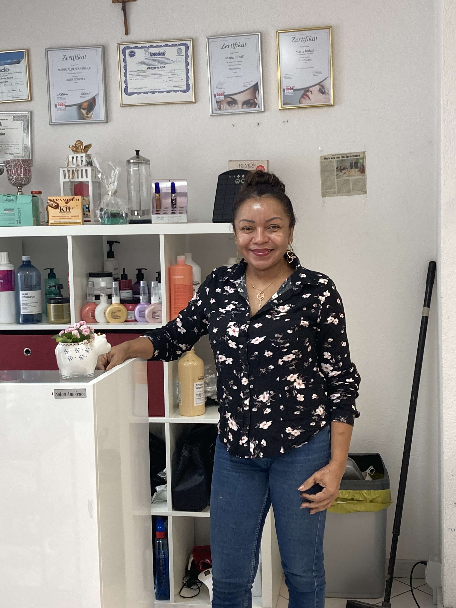
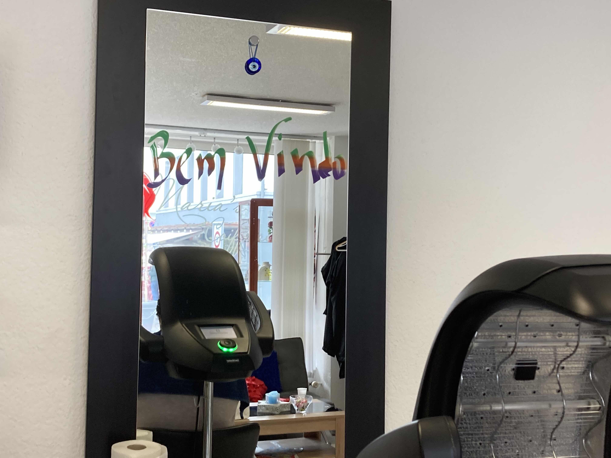

+++
title = "Interview zu Persönlichkeitsveränderung durch Immigration"
date = "2023-03-16"
draft = false
pinned = false
image = "img_5505-copy-min-2.jpg"
+++
# Anpassung und Veränderung, ausgelöst durch eine unterschiedliche Kultur

Als jemand, der selbst von einem anderen Land in die Schweiz immigriert ist, hat es mich gewundert, ob durch das Kennenlernen zweier Kulturen, sich die Persönlichkeit eines Menschens verändern kann. So habe ich Maria Imhof dazu befragt, ob die schweizer Kultur bei ihr persönlich, für eine Veränderung ihrer Persönlichkeit geführt hat.



Maria Imhof (52) ist in Brasilien geboren und lebt seit 2010 in der Schweiz. Sie kam in die Schweiz, weil sie einen Schweizer Mann heiratete, um mit ihm in der Schweiz eine Familie zu gründen. Sie ist eine selbstständige Friseurin mit einem eigenen Haarsalon.



**Victoria Araujo:** Haben Sie sich, seit Sie hergekommen sind, kulturell an die Schweiz angepasst? Befolgen Sie zum Beispiel Schweizer Bräuche oder feiern Sie Schweizer Feiertage?

> Maria Imhof: Ja sicher, ich feier auch Schweizer Feiertage.

Haben Sie aber auch ihre basilianische Kultur behalten? Wenn ja, wie genau haben Sie diese behalten? Also welche Dinge tun Sie dafür?

> Ich treffe immer Freunde und spreche mit ihnen brasilianisch. Wir feiern oft zusammen am Wochenende und machen brasilianische Spezialitäten für den Genus.

Hatte die Umstellung eine Auswirkung auf ihre Persönlichkeit?

> Ja, ich habe mich verändert. Zum Beispiel sind wir in Brasilien nicht pünktlich, aber in der Schweiz muss man bei einem Termin pünktlich sein und das ist zum Beispiel eine Sache die sich bei mir verändert hat.

Sie haben bereits erwähnt, dass Sie Familie in der Schweiz haben, aber haben Sie auch Familie in Brasilien?

> Ja, ich habe auch Familie in Brasilien. Eine Tochter, Brüder, Enkel, generell sehr viele Familienmitglieder, weil meine Wurzeln schliesslich in Brasilien liegen.

Gehen Sie in dem Fall auch oft nach Brasilien?

> Ja, jedes Jahr gehe ich nach Brasilien in die Ferien und besuche meine Familie.

Wenn Sie zurück nach Brasilien könnten würden Sie gehen?

> Ja gerne. Vielleicht nicht jetzt, weil ich eine Tochter habe, die mich braucht, aber vielleicht in 6 Jahren oder mehr, will ich gerne zurück nach Brasilien

Was gefällt ihnen an der Schweiz und was an Brasilien?

> Hier in der Schweiz gefällt mir die Sicherheit, denn es ist wichtig ein gutes und sicheres Leben führen zu können und in Brasilien ist das ein bisschen komplizierter. Ich finde auch, dass die Schweizer Kultur schön ist. In Brasilien gefällt mir, dass die Leute offener sind als hier. Das ist auch ein Grund, warum der Empfang in der Schweiz für mich sehr schwierig war, eben weil Schweizer viel weniger offen und sozial sind als Brasilianer aber jetzt habe ich mich daran gewohnt.

Sie haben ja einige brasilianische Kunden, die zu ihrem Haarsalon kommen und auf einer der Spiegel steht *Bem Vindo*. Versuchen Sie mit ihrem Haarstudio einen sicheren Ort für Brasilianer zu errichten? Quasi ihnen das Gefühl zu geben, als wären sie in Brasilien?

> Ja, ich habe viel Kontakt mit Brasilianern, aber auch mit anderen Personen aus anderen Kulturen und selbstverständlich auch mit Schweizer. Aber die meisten meiner Kunden sind aus Brasilien und es macht mich auch stärker von Brasilianern umgeben zu sein. Der Kontakt mit ihnen und die Zusammenarbeit, machen mich stärker und motivieren mich dazu hier zu leben und mit meiner Arbeit weiterzumachen.

Würden Sie als Fazit sagen, dass die Immigration schon eine Auswirkung auf ihre Persönlichkeit hatte, aber nicht so stark, dass Sie ihre Wurzeln vergessen haben?

> Die Immigration hatte definitiv keine starken Auswirkungen auf meine Persönlichkeit. Ich bin zwar noch hier in der Schweiz, aber mein Koffer ist noch mit mir und meinen Wurzeln in Brasilien.